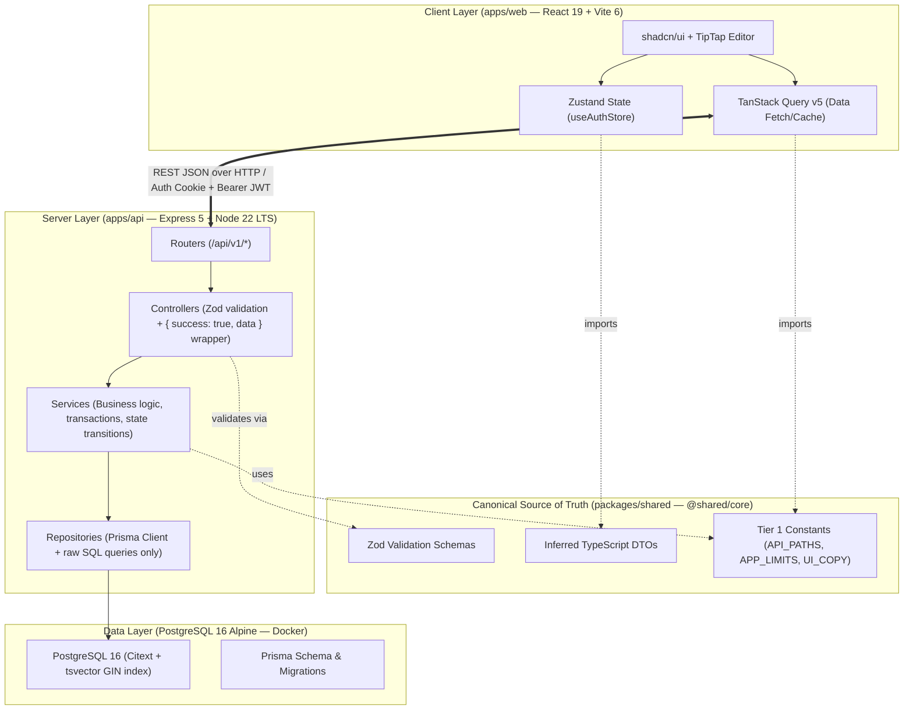
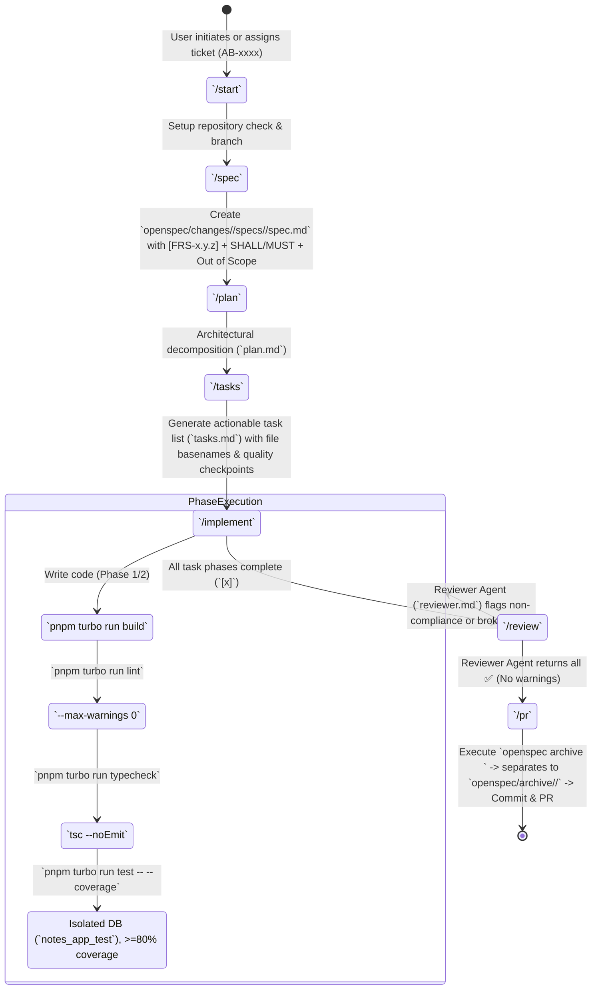

## 1. Project Overview & System Boundaries

The **Universal AI Brain Note-Taking Application** is an enterprise-grade, full-stack monorepo engineered with **Node.js 22 LTS**, **Express 5**, **React 19**, **Vite 6**, **Prisma ORM**, and **PostgreSQL 16 Alpine**. It provides secure, authenticated rich-text (TipTap) note-taking with advanced features including a two-stage Trash lifecycle, high-performance full-text search with XSS-safe highlighted snippets, atomic public share links, user-scoped tagging, and append-only version snapshots.



---

## 2. Pinned Technical Stack & Invariants

All dependencies in this monorepo are **strictly locked and pinned to exact versions (`Rule 20`)**. Zero version ranges (`^`, `~`, `*`, `>=`) or `@latest` tags are permitted anywhere across package manifests.

| Layer / Component | Technology & Exact Versioning | Core Role / Architectural Constraint |
| :--- | :--- | :--- |
| **Runtime & Monorepo** | Node.js `22 LTS`, `pnpm workspaces` `9.x`, Turborepo | `build` pipeline explicitly depends on `^build` (shared build first). |
| **Shared Package** | `packages/shared` (`@shared/core`) | **Absolute Single Source of Truth (`Rule 11`)** for DTOs, Zod schemas, and Tier 1 constants. |
| **Backend API** | Express `5`, TypeScript `5.x`, Prisma ORM `16` | Strict layered architecture (`routers` $\to$ `controllers` $\to$ `services` $\to$ `repositories`). |
| **Frontend Web** | React `19`, Vite `6`, TanStack Query `v5`, Zustand | Rich-text TipTap (`@tiptap/react`) editor, `shadcn/ui`, `<100ms` UI responsiveness (`docs/ux.md`). |
| **Database Engine** | PostgreSQL `16 Alpine` via Docker (`docker-compose`) | Native `Citext` extension and `tsvector` + GIN indexing (`postgresqlExtensions` preview feature). |
| **Quality & Testing** | Vitest, Supertest, Playwright, ESLint, Prettier | Enforces `--max-warnings 0`, `tsc --noEmit` checks, and $\ge 80\%$ test coverage against isolated DBs. |

---

## 3. Core Architectural Rules (`AGENTS.md` & `SDS.md`)

> [!IMPORTANT]
> **Rule 11: Single Source of Truth (`packages/shared`)**  
> Never duplicate TypeScript interfaces, Zod validation schemas, or application constants between `apps/api` and `apps/web`. Both workspaces MUST import directly from `@shared/core`.

> [!WARNING]
> **Strict Backend Layering Boundaries**  
> - **Controllers (`controllers/`)**: ONLY parse inputs (`schema.parse(req.body)`), call services, and wrap outputs in `{ success: true, data: T }` (or standard error wrapper). **Zero SQL or Zod schema declarations in controllers.**  
> - **Services (`services/`)**: ONLY handle business transactions, ownership validation (`note.userId === req.user.userId`), and state transitions.  
> - **Repositories (`repositories/`)**: ONLY interact with database abstractions (Prisma Client queries (`prisma.note...`) and safe raw SQL (`$queryRaw`)).

### Key Functional Specifications (`FRS-x.y.z`)

1. **Authentication & Session Management (`FRS-1.3`)**
   - **Access Token**: 15-minute JWT (`APP_LIMITS.ACCESS_TOKEN_EXPIRY_MINUTES`), stored **purely in client JS memory** (`useAuthStore`). **NEVER** stored in `localStorage` or `sessionStorage`.
   - **Refresh Token**: 7-day expiry, 64-byte random hex, SHA-256 hashed into `RefreshSession.tokenHash`. Issued exclusively inside `HttpOnly`, `Secure`, `SameSite=Strict` cookies with silent rotation.
   - **Rate Limiting**: Exactly 5 wrong-password attempts / 15 minutes per email yields a 15-minute `429 Too Many Requests` lockout (`FRS-1.3.4`). Correct passwords on unverified accounts do not count toward this cap.
   - **OTP Verification**: Case-insensitive email OTP (`CONSUMED | INVALIDATED`), 6 digits, 10-minute expiry, 3 max attempts (`FRS-1.2.4a`).

2. **Two-Stage Trash Lifecycle (`FRS-2.2`)**
   - **Stage 1 (Restorable Trash)**: Deleting a note sets `deletedAt = NOW()`. Notes stay user-restorable for 30 days (`APP_LIMITS.TRASH_RETENTION_DAYS`).
   - **Stage 2 (Audit-Only Trash)**: After 30 days, notes transition to Stage 2 (`deletedAt + 30 days`), hidden from user views but preserved for audit recovery for another 30 days (`APP_LIMITS.AUDIT_RETENTION_DAYS`).
   - **Nightly Purge Job**: Node-cron (`03:00 UTC`, `cleanup.job.ts`) permanently deletes all notes exceeding the 60-day combined retention, cascading to all versions, tags (`NoteTag`), and share links (`ShareLink`).

3. **PostgreSQL Full-Text Search (`FRS-4.2`)**
   - Database trigger `notes_search_vector_update()` automatically populates the `search_vector` column using weighted fields (`Title=A`, `Body=B`) and indexes via `GIN` (`notes_search_vector_gin`).
   - Snippet highlighting (`ts_headline`) uses safe sentinels (`[[[MARK]]]`/`[[[MARK_END]]]`) parsed via string splitting in React—never using `dangerouslySetInnerHTML` (`FRS-4.2.1`).

4. **Public Read-Only Share Links (`FRS-5.1`)**
   - `/api/v1/public/share/:token` executes a single atomic `UPDATE ... RETURNING` query that increments `viewCount` while verifying `deletedAt IS NULL`, `revokedAt IS NULL`, and `expiresAt > NOW()`.
   - Any failure or expiration returns `404 Not Found` without revealing whether the link was expired, revoked, or never existed (`SDS §2.2`).

---

## 4. How to Do Spec-Driven Development (`Spec-Driven Dev` / OpenSpec Workflow)

All feature development, bug fixes, refactoring, and architectural modifications in this repository strictly follow **Spec-Driven Development** governed by **OpenSpec (`@fission-ai/openspec`)**.

No code is ever written directly without first designing, validating, and recording explicit domain specifications (`specs/<domain>/spec.md`) and operational checklists (`tasks.md`).



---

### Step-by-Step OpenSpec Command Lifecycle

#### Phase 1: Initiation (`/start`)
- **Objective**: Establish workspace hygiene and context alignment.
- **Actions**:
  1. Verify working branch status and repository synchronization.
  2. Read active FRS (`docs/FRS.md`), SDS (`docs/SDS.md`), and `AGENTS.md`.
  3. Identify the ticket ID (`AB-xxxx`) and establish clear scope.

#### Phase 2: Specification Creation (`/spec`)
- **Objective**: Write precise domain deltas using strict RFC 2119 requirement language before planning any code changes.
- **Actions**:
  1. Create the active change directory:  
     `openspec/changes/<AB-xxxx-human-readable-name>/`  
     *(Example: `openspec/changes/AB-1008-notes-full-text-search/`)*
  2. Create the specification delta file:  
     `openspec/changes/<AB-xxxx-name>/specs/<domain>/spec.md`  
     *(Example: `specs/notes/spec.md` or `specs/auth/spec.md`)*
  3. **Strict Rules for `spec.md`**:
     - **RFC 2119 Terms**: Must use `SHALL`, `MUST`, `SHOULD`, `MAY` (never ambiguous terms like "should automatically").
     - **Requirement Traceability**: Every requirement delta must cite existing or newly numbered `[FRS-x.y.z]` requirement IDs and `[SDS §x.y]` references.
     - **Out of Scope Section**: Must include an explicit `## Out of Scope` section delineating exact boundaries to prevent scope creep.

#### Phase 3: Architectural Planning (`/plan`)
- **Objective**: Translate functional specifications into concrete technical layers (`plan.md`).
- **Actions**:
  1. Create `openspec/changes/<AB-xxxx-name>/plan.md`.
  2. Define shared DTO modifications, Zod validation schemas, and Tier 1 constants to be added in `packages/shared`.
  3. Document data model deltas (`schema.prisma` migrations, `Citext` fields, GIN indexes, SQL triggers).
  4. Map backend layers explicitly:
     - `routers/` $\to$ endpoint HTTP verbs & auth middleware requirements.
     - `controllers/` $\to$ Zod parsing requirements & wrapper schema.
     - `services/` $\to$ transactional logic, soft-delete conditions, error throwing.
     - `repositories/` $\to$ Prisma query structure & exact `$queryRaw` statements.
  5. Define frontend state impacts (`useAuthStore`, TanStack Query keys, TipTap component updates).

#### Phase 4: Task Decomposition (`/tasks`)
- **Objective**: Break down the architectural plan into atomic, sequentially verifiable task checkboxes (`tasks.md`).
- **Actions**:
  1. Create `openspec/changes/<AB-xxxx-name>/tasks.md`.
  2. Group tasks strictly by dependency order:
     - **Phase 1: Shared Core (`packages/shared`)** — Schemas, types, Tier 1 constants.
     - **Phase 2: Database & Backend (`apps/api`)** — Migrations, repositories, services, controllers, routers.
     - **Phase 3: Frontend (`apps/web`)** — API hooks, store state, UI components, pages.
     - **Phase 4: OpenSpec Compliance Audit** — Read-only verification check.
  3. **Strict Task Checklist Rules**:
     - Every item must specify the exact file basename (`[NEW] [NoteSearch.tsx](file:///...)` or `[MODIFY] [note.service.ts](file:///...)`).
     - Every verification item must map directly to at least one `[FRS-x.y.z]` requirement ID.
     - **Mandatory Quality Checkpoints**: At the conclusion of Phase 1 and Phase 2, explicitly insert a checklist item requiring a complete run of the 4 DoD Quality Gates (`build`, `lint`, `typecheck`, `test`).

#### Phase 5: Implementation Execution (`/implement`)
- **Objective**: Execute code changes precisely as detailed in `tasks.md`, checking off items as completed (`[x]`).
- **Actions**:
  1. Modify files layer-by-layer, strictly honoring `Rule 11` (shared first) and controller/service/repository isolation.
  2. Write unit (`Vitest`), contract (`Supertest`), and E2E (`Playwright`) tests derived **solely from `FRS-x.y.z` text and `SDS` contracts** (never from high-level Acceptance Criteria lines per `test-writer.md`).
  3. All tests MUST run against isolated `notes_app_test` databases (`[FRS-0.3.3]`). **Zero SQLite memory databases or production DB connections.**
  4. Execute DoD Quality Checks continuously during implementation:
     ```bash
     # Verify 0-error bundling via tsup
     pnpm turbo run build

     # Verify zero lint warnings (--max-warnings 0 enforced)
     pnpm turbo run lint

     # Verify zero TypeScript type mismatches across all workspaces
     pnpm turbo run typecheck

     # Execute test suite against isolated notes_app_test (must achieve >= 80% coverage on new code)
     pnpm turbo run test -- --coverage
     ```

#### Phase 6: Code & Specification Review (`/review`)
- **Objective**: Independent verification via the AI `reviewer.md` agent or human reviewer to validate full alignment before merge.
- **Actions**:
  1. Execute `openspec validate` to confirm schema and specification structural soundness.
  2. Reviewer checks code deltas against `specs/<domain>/spec.md`, `FRS.md`, and `SDS.md`.
  3. Verify that zero DTO duplication occurred, zero tokens are stored in local storage, and zero unpinned dependencies were introduced.
  4. Record review results inside `openspec/changes/<AB-xxxx-name>/review-log.md`.
  5. If any gaps or warnings exist, return to `/implement`. Only when all checks return ✅ may the workflow advance to `/pr`.

#### Phase 7: Specification Archival & Pull Request (`/pr`)
- **Objective**: Merge the specification deltas into canonical system specs, archive historical change folders, and prepare commit/PR submission.
- **Actions**:
  1. **Execute Archival Command**:
     ```bash
     openspec archive <AB-xxxx-name>
     ```
     This automatically merges the deltas inside `specs/<domain>/spec.md` into the permanent system specifications (`openspec/specs/<domain>/spec.md`) and separates out the historical change directory into `openspec/archive/<AB-xxxx-name>/`.
  2. **Verify Separation**: Ensure the active `changes/<AB-xxxx-name>/` directory is fully moved to `archive/<AB-xxxx-name>/`.
  3. **Stage and Commit**:
     ```bash
     git add .
     git commit -m "feat(notes): implement full-text search and highlighting AB#1008"
     ```
     *(Enforced strictly by `commitlint` + Husky `commit-msg` hook)*

---

## 5. OpenSpec Directory Structure & Lifecycle Map

```
openspec/
├── config.yaml                    # Global OpenSpec config (schema: spec-driven, active change rules)
├── project.md                     # Compressed canonical context summary for OpenSpec AI prompts
├── changes/                       # Active Change Specifications (Work in Progress — deleted on /pr)
│   └── AB-1008-notes-search/      # Descriptive kebab-case folder with ticket ID
│       ├── specs/
│       │   └── notes/
│       │       └── spec.md        # Delta specification with RFC 2119 SHALL/MUST & Out of Scope
│       ├── plan.md                # Architectural layering mapping & DB migration strategy
│       ├── tasks.md               # Sequentially checked implementation tasks & quality checkpoints
│       └── review-log.md          # Comprehensive review log tracking auditor notes & verifications
└── archive/                       # Historical Immutable Archives (Created ONLY when /pr executes archive)
    ├── AB-1001-project-setup/
    ├── AB-1002-auth-rate-limiting/
    └── AB-1008-notes-search/      # Moved here upon running `openspec archive AB-1008-notes-search`
```

---

## 6. Quick Verification & Execution Cheat Sheet

| Action | Exact Command | Purpose & DoD Requirement |
| :--- | :--- | :--- |
| **Install & Setup** | `pnpm install --frozen-lockfile && docker compose up -d postgres` | Exact lockfile installation with local PostgreSQL 16 `Citext`/GIN container. |
| **Run Migrations** | `pnpm --filter @.../apps/api prisma migrate dev` | Apply schema changes and trigger/citext updates against local dev DB. |
| **Start Dev Servers**| `pnpm turbo run dev` | Launch both Express API (`:5000` or `:3000`) and Vite React E2E dev server (`:5173`). |
| **Verify Bundle** | `pnpm turbo run build` | Validate `tsup` bundles `apps/api` + `@shared/core` with zero resolution errors. |
| **Verify Code Quality**| `pnpm turbo run lint` | Run ESLint across all workspaces with `--max-warnings 0` strictly enforced. |
| **Verify Types** | `pnpm turbo run typecheck` | Run `tsc --noEmit` across all workspaces (`0 static errors` required). |
| **Run Test Suite** | `pnpm turbo run test -- --coverage` | Vitest + Supertest against `notes_app_test` (`>= 80% coverage` on new code required). |
| **Archive Spec (`/pr`)** | `openspec archive <AB-xxxx-name>` | Merge deltas to canonical `specs/` & separate to `archive/` right before staging PR. |
